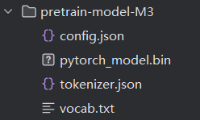

# IOPC
This repository contains the code for our paper ????

We achieve our code based on RSTC https://github.com/hmllmh/RSTC.

If you want to run this code, first download the M3 model from https://huggingface.co/BAAI/bge-base-en-v1.5/tree/main to the project folder like the follow figure, and then you can run run_all.py.

If you use our code, please cite the paper.
# IOPC-origin
